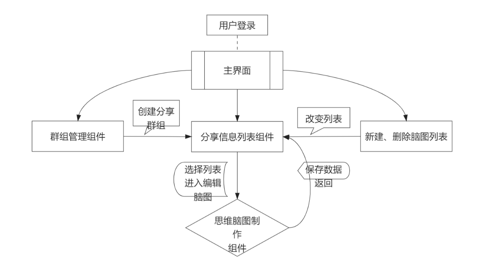
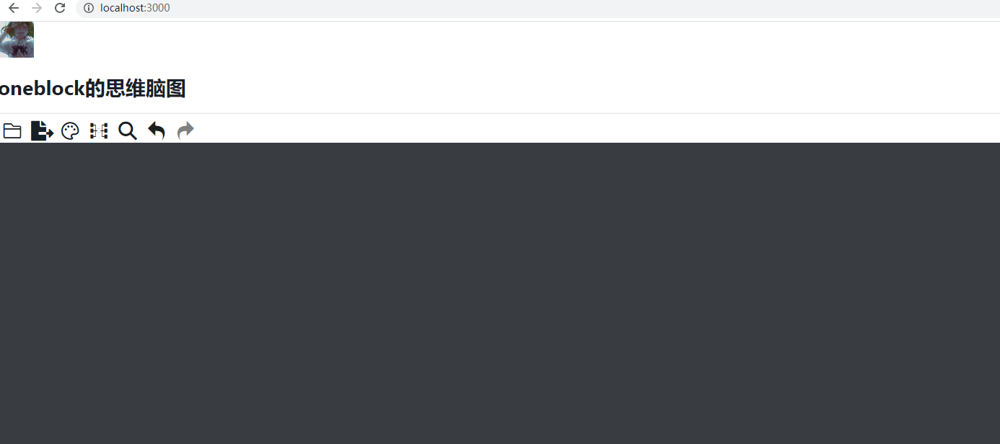

# blockstack-mind v0.0.0

## **简要说明**
* 原来作品不适合做数据分享。本来想利用blink-mind做一个插件嵌入原来作品做思维脑图分享，但是个人技术有限。感觉干脆直接做一个思维脑图单独作品容易一些。计划单独做一个思维老图分享。
* 这儿首先感谢`@awehook`提供的blink-mind的插件，避免了再次造轮子。让我做不到事情变成可能。[插件地址:https://github.com/awehook/blink-mind](https://github.com/awehook/blink-mind)
## **流程图**
  
## **实例图**
  
## 需求设计
* **思维脑图制作**
* **支持多设备**
* **群组内思维脑图分享**

## 实现方式
* **主体前端框架**：`react`
* **身份证认证与加密**：`blockstack`
* **图形框架**：`blink-mind`
* **数据存储**：`blocstack.gaia`、`radiks`

## 目前进度
 ### var=0

## 使用测试方法

* **安装方法**
```code
    npm install
```
* **测试方法**
```code
    npm start
```
* **构建方法**
```code
    npm run build
```